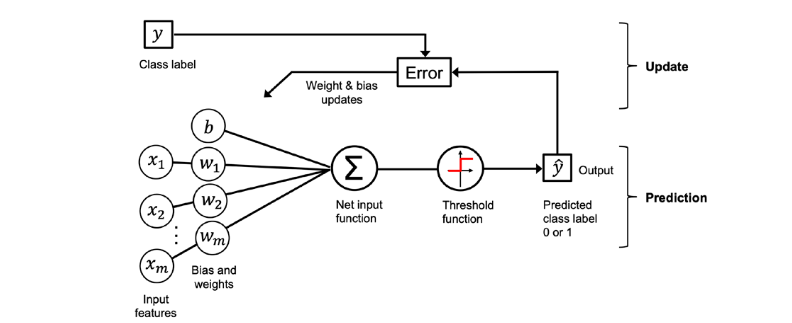

# Perceptron Implementation in Python

## Overview

Implementation of a Perceptron classifier in Python using NumPy. The perceptron is one of the simplest forms of artificial neurons and serves as a foundational concept in machine learning and neural networks.

It demonstrates how a binary classifier learns from labeled data by updating its weights and bias through iterative training.


## What the Perceptron Learns

A perceptron takes input features, computes a weighted sum, and applies a step function to produce a binary decision:

- Input values are multiplied by learned weights
- A bias term is added
- The result is passed through a thresholding function
- The model adjusts its parameters to improve classification accuracy

This implementation is useful for understanding the core mechanics behind supervised learning and early neural network models.


<p align="center">
  
</p>


## Project Structure

- `src/perceptron.py` — Contains the `Perceptron` class and its core methods

## Features

- Binary classification support
- Configurable learning rate (`eta`)
- Configurable number of training epochs (`n_iter`)
- Random weight initialization for stability and reproducibility
- Simple training and prediction workflow

## Requirements

Ensure that NumPy is installed before running the code:

```bash
pip install numpy
```

## Implementation Details

The implementation includes the following methods:

- `fit(X, y)`: trains the model on input data and target labels
- `net_input(X)`: computes the weighted input plus bias
- `predict(X)`: returns binary predictions based on the activation threshold

## Example Usage

```python
import numpy as np
from src.perceptron import Perceptron

# Example dataset
X = np.array([[0, 0], [0, 1], [1, 0], [1, 1]])
y = np.array([0, 0, 0, 1])

# Create and train the model
model = Perceptron(eta=0.1, n_iter=10, random_state=1)
model.fit(X, y)

# Make predictions
predictions = model.predict([[0, 0], [1, 1]])
print(predictions)
```


The perceptron is historically significant because it introduced the idea of learning through error correction. Although modern deep learning models are far more advanced, the perceptron remains an excellent starting point for understanding how neural networks learn from data.
 